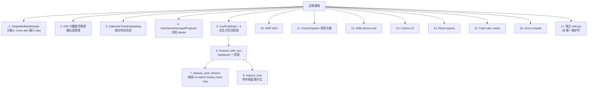

# 2026-taac
## 初赛TOP9（因腾讯实习生，取消资格）

# 【0.833830】相对 taac-baseline —— 新增优化点清单
## 一、模型结构层新增（5 大类）

### 1. Target-aware Cross-Attention Bias（方案 A） ⭐ 核心
- **新增组件**：`TargetAttnBiasModule`（[model.py L443](file:///Users/yueming/CodeBuddy/taac/【0.833830】taac-infonce优化/model.py)）+ `--use_target_attn_bias` CLI
- **解决问题**：右侧 cross-attn 完全靠 Q（query token）去"猜"该关注哪段历史，没有 target 先验信号。
- **怎么做**：把 target item 的表征转成 **未归一化 raw bias**，加在每层 HyFormer cross-attn 的 logits（softmax 之前）。
- **关键实现**：
  - `alpha = nn.Parameter(0.0)` learnable 门控 → 训练初期完全退化为基线，安全无害；
  - bf16 amp 下不出现 NaN（旧的 `ImportanceWeightedQueryGenerator` 序列原地重写方案在 amp 下会 NaN，已被本方案取代）。
- **不冗余性**：DIN 是 *输出* 残差、cross-attn 本体是自由学习的 attention、本方案是 *输入侧* 加性 prior —— 三者作用位置不同。

### 2. DIN 兴趣激活残差
- **新增组件**：`DINQueryBuilder`（L1456）+ `DINInterestActivation`（L1490）+ `--use_din --din_top_k --din_hidden_mult`
- **解决问题**：HyFormer 输出向量缺乏 "对当前 target 的兴趣浓度" 这一显式信号。
- **怎么做**：用 item_ns + item_dense 拼成 target query，在每个 domain 的 top-K 历史行为上做 attention pooling，作为 **输出层残差** 加到 logits 输入向量上。
- **不冗余性**：DIN 走输出残差（output += DIN(target, seq)），与方案 A 走 attention 输入 bias 的位置不重叠，二者可叠加增益。

### 3. Calendar 绝对时间嵌入
- **新增组件**：`CalendarTimeEmbedding`（L1351）+ dataset 端 `_build_calendar_int_feats` + `--use_time_feats`
- **解决问题**：右侧只用 RoPE 编码相对位置，缺乏"周末/早晚高峰/节假日"等绝对时间先验。
- **怎么做**：把 unix 秒戳拆成 9 列 UTC+8 日历 ID（year/month/day/hour/minute/weekday/week_of_year/quarter/...），各自独立 embedding 后拼接 + LayerNorm，注入 NS token。
- **不冗余性**：RoPE = 相对位置；time_bucket = domain 内桶化序列位置；CalendarEmbedding = 绝对挂历语义 —— 三者编码不同时间维度。

### 4. User Dense 分组投影
- **新增组件**：`UserDenseGroupedProjector`（L1385）+ `--user_dense_grouped`
- **解决问题**：右侧 user_dense 走单一大 MLP，把语义异构的 dense 特征（属性 / 兴趣 / 统计 / 行为聚合）强制混在一个权重里。
- **怎么做**：按语义分组，每组独立 MLP → d_model，再拼接 + LayerNorm。
- **不冗余性**：是对 *已有 user_dense 通路* 的替换性升级，不引入新信息源。

### 5. Auxiliary 投影头三件套
- **新增组件**：`AuxProjHead`（L1822），在主模型里实例化 `aux_user_head / aux_item_head / aux_sample_head` + `aux_rank_scale`
- **解决问题**：对比学习需要在独立子空间计算余弦相似度，不能直接用主任务的 logit head。
- **怎么做**：2 层 MLP + LayerNorm + L2-norm 投到 `aux_proj_dim`；`aux_rank_scale = nn.Parameter(0.0)` 让 InfoNCE 的尺度端到端可学。
- **不冗余性**：与主任务 `clsfier` 完全解耦，用独立参数空间承载对比信号。

---

## 二、训练目标层新增（多任务对比学习） ⭐ 核心

### 6. forward_with_aux：一次前向多任务复用
- **位置**：[PCVRHyFormer.forward_with_aux L2601](file:///Users/yueming/CodeBuddy/taac/【0.833830】taac-infonce优化/model.py)
- **解决问题**：朴素做法是主任务跑一次 backbone、对比任务再跑一次，显存与时间翻倍。
- **怎么做**：训练时一次前向同时返回 `(logits, u_repr, i_repr, s_repr, position_aux={seq_repr_list, seq_mask_list})`，所有对比损失共用同一组 backbone 表征。
- **不冗余性**：推理时走原 `forward()`，aux 头不参与，无推理开销。

### 7. listwise_rank_infonce_loss：候选 + in-batch + history hard-neg 三合一
- **位置**：[utils.py L507](file:///Users/yueming/CodeBuddy/taac/【0.833830】taac-infonce优化/utils.py)
- **解决问题**：CTR/CVR 中正样本极稀疏，单纯 BCE 学不到强判别边界。
- **怎么做**：
  - 候选池 = 正样本 self item ∪ in-batch easy negatives ∪ same-user history hard negatives
  - hard-neg 采样：在每个用户全部历史行为里用 `rand+topk` 在 GPU 一次性抽 N 条（带 padding mask），无 CPU 同步
  - `pos_weight=2.0` 提升正样本梯度权重
  - 数值安全：温度下界 1e-6、in-batch 自身位置 mask 为 -1e9
- **CLI**：`--use_aux_loss --aux_candidate_count --aux_temperature --aux_positive_weight --aux_history_weight --aux_history_max_per_sample --aux_history_pos_weight --aux_history_domain`
- **不冗余性**：主任务还是 BCE/Focal，InfoNCE 是 *额外的* 排序信号，权重 0.1 加权融合。

### 8. supcon_loss：样本级监督对比
- **位置**：[utils.py L603](file:///Users/yueming/CodeBuddy/taac/【0.833830】taac-infonce优化/utils.py)
- **解决问题**：InfoNCE 是 user-item pair 级别，缺乏"同 label 样本应靠近"的样本级聚类先验。
- **怎么做**：在 `aux_sample_head` 输出的 sample-level 表征上做 SupCon（同 label pull、异 label push）。
- **CLI**：`--use_supcon --supcon_weight --supcon_temperature`

### 9. 其他 5 个备选损失
`sampled_nce_loss / option_softmax_loss / pair_block_softmax_loss / batch_pair_softmax_loss / info_nce_inbatch_loss` —— 作为对比损失家族的轻量替代实现，便于消融实验。

---

## 三、训练系统层新增（trainer.py 大改）

### 10. AMP 混合精度训练
- `--amp --amp_dtype bf16/fp16`，bf16 直接 cast 不需 GradScaler，fp16 自动启用 `GradScaler`。
- run.sh 默认 `bf16`：在 H100/A100 上吞吐翻倍且无溢出风险。

### 11. Dense / Sparse 双优化器
- `dense 参数 → AdamW`（可选 `--fused_adamw`，CUDA fused kernel）
- `sparse 参数 → Adagrad`（embedding 表稀疏更新更稳）
- 通过 `model.get_sparse_params() / get_dense_params()` 自动拆分。

### 12. EMA（仅 dense 参数）
- **新增组件**：`EMAModel`（[utils.py L662](file:///Users/yueming/CodeBuddy/taac/【0.833830】taac-infonce优化/utils.py)）
- **关键设计**：
  - **embedding 排除**：`exclude_param_ids = {p.data_ptr() for p in model.get_sparse_params()}`，避免显存爆炸 + 不污染稀疏新 token 的冷启动；
  - **延迟启动**：`--ema_start_epoch 2`，第 1 epoch 高方差梯度不入 EMA；
  - **评估/落盘**：评估时用 EMA 权重，best_ckpt 也存 EMA 版（推理直接复用）。

### 13. Cosine LR 调度
- `--use_cosine_lr --min_lr 1e-6`，配合 EMA 的"末期低 LR + 平均权重"组合拳。

### 14. Reinit Sparse After Epoch
- `--reinit_sparse_after_epoch 1 --reinit_cardinality_threshold`：第 N epoch 后重置低频 embedding，缓解长尾 token 噪声。

### 15. Flash-Attn varlen
- `--use_flash_attn_varlen`：在 RoPEMultiheadAttention / LongerEncoder 里启用 Tri-Dao flash-attn variable-length 内核，**这是右侧 LongerEncoder 完全没有的入参**（对比左右两侧 `__init__` 即可看到）。

### 16. torch.compile
- `--torch_compile --compile_mode default`：图捕获 + 融合，进一步压低 step time。

---

## 四、训-推一致性新增

### 17. 独立的 infer.py
- **位置**：[推理文件/infer.py](file:///Users/yueming/CodeBuddy/taac/【0.833830】taac-infonce优化/推理文件/infer.py)
- **关键护栏**：推理时把 `use_aux_loss=False`，但 **保留** `use_target_attn_bias=True / target_attn_bias_dropout=0.0` 等参数与训练 ckpt 严格对齐 —— 否则 `target_bias_modules.* / target_bias_alpha` 会报 unexpected keys。
- 这是右侧没有的训-推一致护栏。

---

## 五、所有新增优化点的全景图

---

## 六、信息非冗余性核对表

| 新增点 | 与已有组件的关系 | 是否冗余 |
| --- | --- | --- |
| TargetAttnBias | 加在 cross-attn softmax 之前，alpha 初值 0 | ✅ 不冗余 | +1.5k 
| DIN 残差 | 加在 logits 输入向量（输出残差），位置与 attn bias 不重合 | ✅ 不冗余 | +2k 
| CalendarEmbedding | 绝对时间维度，RoPE 是相对维度 | ✅ 不冗余 | +9k
| UserDense 分组 | 是已有通路的内部升级 | ⚠️ 替代关系 | +5k
| AuxProjHead | 独立子空间，不共享 logit head 参数 | ✅ 不冗余 | +1k
| listwise InfoNCE | 主任务仍是 BCE，InfoNCE 是辅助加权项 | ✅ 不冗余 | +1.5k
| SupCon | 样本级，与 pair 级 InfoNCE 不重叠 | ✅ 不冗余 |
| EMA | 只对 dense，不动 sparse | ✅ 不冗余 | +0.5k
| Flash-attn varlen | 替换原 SDPA kernel，等价计算更快 | ⚠️ 替代关系 |

---
相对baseline共新增 **16 个优化点**，覆盖 **target prior 注入（方案A + DIN）**、**多任务对比学习（候选 InfoNCE + history hard-neg + SupCon）**、**EMA + 双优化器 + cosine 训练范式**、**AMP / flash-attn / compile 系统加速**
